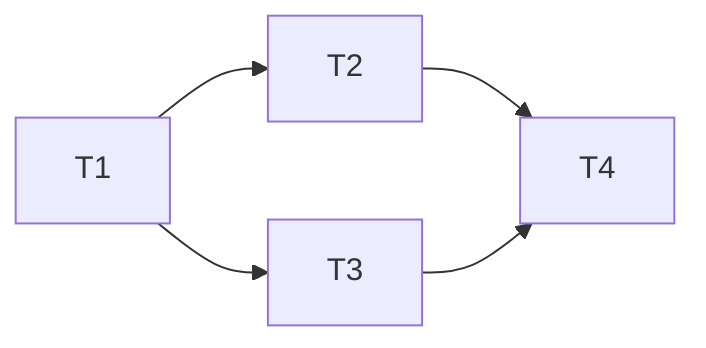

# Harness Orchestrator — Team Orchestrator

## Core Philosophy

**Humans steer, agents execute.** The engineer's role shifts from writing code to designing environments, articulating intent, and building feedback loops.

## Hooks Integration

This orchestrator automatically triggers hooks defined in `hooks-framework` at each phase:

- **Pre-execution**: context-check, env-verify, plan-inject
- **Post-execution**: lint-check, test-run, quality-gate
- **Interception**: continuation (Ralph Loop), compaction, tool-offload
- **Observation**: trace-log, quality-metric, drift-detect

See `.agents/skills/hooks-framework/SKILL.md` for details.

## Phase 0: Context Check

### Environment Pre-check

Before workflow starts, verify required tooling is available:

| Tool | Check | Action if Missing |
|------|-------|-------------------|
| git | `git --version` | Abort: install git |
| bun / node | `bun --version` / `node --version` | Abort: install runtime |
| npm / bun | lockfile detection | Warning: package manager mismatch |
| AI tool (claude-code/codex/opencode) | config file scan | Warning: missing target AI config |

Fail fast: if any **Abort** check fails, halt before creating directories or writing files.

### Execution Mode Determination

Check existing outputs to determine execution mode:

- `.harness-pilot/` exists + user requests partial modification → **Partial Re-execution**
  - **Scope Mapping**: User specifies target skill/files → orchestrator maps to affected Phases:
    - Single skill edit → Phase 4 + 5 + 6 only
    - AGENTS.md edit → Phase 3 + 5 + 6 only
    - Architecture change → Phase 2 + 3 + 4 + 5 + 6
  - **File-level Targeting**: Pre-existing files not in scope are preserved, not overwritten
  - **Stale Dependency Detection**: If a dependency of the target file has changed, cascade-rebuild affected files
- `.harness-pilot/` exists + user provides new input → **New Execution** (write outputs directly into `.harness-pilot/`, overwriting existing files)
- `.harness-pilot/` does not exist → **Initial Execution**

## Phase 1: Project Discovery & Requirements Analysis

**Execution Mode: Sub-agent**

1. Parallel discovery calls:
   - Tech stack identification (package.json / Cargo.toml / go.mod / pyproject.toml)
   - Directory structure analysis
   - Existing documentation scan
   - Target AI tool detection (claude-code / codex / opencode)

2. Output: `01_project_analysis.json`

```json
{
  "tech_stack": "typescript",
  "framework": "next.js",
  "target_tools": ["claude-code", "codex", "opencode"],
  "existing_docs": [],
  "directory_structure": {},
  "total_files": 2480,
  "total_dirs": 320,
  "scale_tier": "large",
  "scale_reasoning": "2480 files, 15 source modules, cross-module dependencies detected"
}
```

## Phase 2: Architecture Design

**Execution Mode: Agent Team**

1. Create team: architect + context-engineer
2. architect designs layered architecture rules
3. context-engineer plans knowledge base structure
4. Team members coordinate via SendMessage

**Output:**
- `02_architecture.md` — Architecture design
- `02_context_plan.md` — Knowledge base plan
- `02_plan.md` — Execution plan (task breakdown, dependencies, parallel strategy)

## Phase 3: Knowledge Base Construction

**Execution Mode: Agent Team (context-engineer + builder)**

### AGENTS.md Generation Standard

AGENTS.md must follow the **≤100 lines** constraint with:

| Section | Required | Max Lines |
|---------|----------|-----------|
| Architecture Map | Yes | 15 |
| Key Constraints | Yes | 10 |
| Agent Team | Yes | 25 |
| Skills | Yes | 25 |
| Navigation | Yes | 25 |

Structure: top-level directory tree → file-level pointer map → key constraints → agent/skill registry → navigation quick-ref.

### docs/ Directory Structure

```
docs/
├── architecture.md        — Layered architecture rules (from Phase 2)
├── CHANGELOG.md           — Change history
├── decisions/
│   └── *.md               — Architecture Decision Records (ADRs)
├── api/
│   └── *.md               — API documentation (if applicable)
└── operations/
    └── *.md               — Runbooks, deploy, observability
```

### Collaboration Flow

1. **context-engineer** reads `02_architecture.md` and `02_context_plan.md` from Phase 2
2. **context-engineer** generates AGENTS.md header: architecture map, key constraints, agent table
3. **context-engineer** generates docs/ skeleton: creates directory structure, writes ADR templates
4. **builder** fills skeleton documents: reads source code, extracts file-level pointers, populates doc content
5. **context-engineer** reviews builder output for AGENTS.md compliance (≤100 lines, navigation accuracy)
6. Both sign off via status file (`.harness-pilot/phase3_complete.json`)

**Validation Gate:** AGENTS.md must pass `wc -l` ≤ 100 check; docs/ must have no empty `.md` files.

**Output:**
- `AGENTS.md`
- `docs/` directory and populated documents
- `.harness-pilot/phase3_complete.json`

## Parallel Execution Strategy

**Principle:** Independent subtasks execute in parallel, dependent tasks execute serially.

### Sub-agent Generation Mechanism

1. **Task Breakdown**: Read task list from `02_plan.md`
2. **Dependency Analysis**: Identify dependencies between tasks
3. **Parallel Grouping**: Group tasks with no dependencies; each group can execute in parallel
4. **Sub-agent Generation**: Generate independent sub-agents for each task group

### Parallel Execution Rules

| Rule | Description |
|------|------|
| Max Parallelism | Default 3 sub-agents (configurable) |
| Timeout Control | Each sub-agent 10-minute timeout |
| Error Handling | Single sub-agent failure does not affect others |
| Result Aggregation | Collect results after all sub-agents complete |

### Sub-agent Communication

- **Shared Filesystem**: Share data via `.harness-pilot/` directory
- **Message Passing**: Coordinate via SendMessage (only when necessary)
- **Status Files**: Each sub-agent writes status files (`.harness-pilot/subagent_*.json`)

> **Implementation Details:** Sharding, git worktree isolation, batch merge, and progress aggregation for massively parallel scenarios (200+ tasks) are documented in the execution engine specification. See `.agents/engine/parallel-execution.md`.

## Phase 4: Skill Generation

**Execution Mode: Sub-agent (parallel)**

### Skill Selection Criteria

Select from standard skill packages based on Phase 1 analysis:

| Project Profile | Required Skills | Optional Skills |
|----------------|----------------|-----------------|
| API proxy / gateway | format-translation, provider-routing, streaming, request-pipeline | rate-limit, response-cache |
| Web app / SaaS | request-pipeline, quality-gate, hooks-framework | web-search, entropy-gc |
| CLI / Tool | agent-readability, context-setup, hooks-framework | mcp-connector |
| AI Agent platform | mcp-connector, web-search, quality-gate, format-translation | streaming, provider-routing |
| Library / SDK | quality-gate, hooks-framework, entropy-gc | agent-readability |

### Skill Generation Template

Each skill in `.agents/skills/<skill-name>/SKILL.md` must include:

```markdown
---
name: <skill-name>
description: '<one-line description>'
triggers: <trigger keywords>
---

# <Skill Name>

## Purpose
<why this skill exists, 2-3 sentences>

## Workflow
<numbered steps for execution>

## Validation
<how to verify output correctness>

## Dependencies
<other skills or files this skill depends on>
```

### Validation Standards

| Check | Criteria | Pass/Fail |
|-------|----------|-----------|
| Frontmatter | name, description, triggers present | Required |
| No orphan templates | No placeholder text (e.g., "TODO", "FIXME") | Required |
| Trigger coverage | triggers match at least one pattern in .agents/manifest.json | Required |
| Cross-reference | All internal file references resolve to existing paths | Required |
| Max length | ≤ 200 lines per skill file | Recommended |

**Output:**
- Skill files under `.agents/skills/<skill-name>/SKILL.md`
- Updated `.agents/manifest.json` (if exists)

## Phase 5: Quality Review

**Execution Mode: Agent Team**

1. Create team: reviewer + architect
2. reviewer reviews all deliverables
3. architect verifies architecture constraint consistency

**Output:**
- `05_review_report.md` — Review report

## Phase 6: Verification

**Execution Mode: Sub-agent**

1. qa agent performs structural verification
2. qa agent performs trigger verification
3. qa agent performs dry-run verification

**Output:**
- `06_verification_report.md` — Verification report

## Phase 7: Registration & Delivery

**Execution Mode: Sub-agent**

1. Generate CLAUDE.md (harness pointer only, change history → docs/CHANGELOG.md)
2. Clean up `.harness-pilot/` intermediate artifacts per cleanup strategy
3. Generate final delivery checklist

### File Cleanup Strategy

| Artifact Type | Retention | Location |
|--------------|-----------|----------|
| Phase outputs (01_*.json, 02_*.md, etc.) | Archive to `.harness-pilot/completed/` | `.harness-pilot/` root → archive |
| Sub-agent status files | Delete | `.harness-pilot/subagent_*.json` |
| Phase complete markers | Delete | `.harness-pilot/phase*_complete.json` |
| Execution plans | Archive (read-only) | `.harness-pilot/completed/02_plan.md` |
| Progress aggregates | Delete | `.harness-pilot/progress.json` |
| Final deliverables (AGENTS.md, docs/, skills/) | Preserve in project root | Project root |

**Rule:** Never delete AGENTS.md, docs/, or `.agents/skills/`. Only intermediate build artifacts are cleaned.

**Output:**
- `CLAUDE.md`
- Delivery checklist
- `.harness-pilot/completed/` with archived plans

## Phase 8: Feedback Collection

**Execution Mode: Sub-agent**

1. Generate feedback prompt for user: "Are the generated skills and knowledge base meeting your needs?"
2. Collect structured feedback (rating 1-5, free-text comments)
3. Write feedback to `.harness-pilot/feedback.json`
4. If feedback score < 3: auto-trigger `harness-evolve` skill for improvement iteration
5. If feedback score >= 3: mark harness configuration as stable

**Output:**
- `.harness-pilot/feedback.json` — Feedback record
- Auto-trigger to `harness-evolve` if score < 3

## Input/Output Protocol

| Phase | Output Location | Next Phase Reads |
|-------|----------|---------------------|
| 1 | `.harness-pilot/01_*.json` | Phase 2 reads |
| 2 | `.harness-pilot/02_*.md` | Phase 3 reads |
| 3 | Project root | Phase 4+ reads directly |
| 4 | `.agents/skills/` | Phase 5 reads |
| 5 | `.harness-pilot/05_*.md` | Phase 6 reads |
| 6 | `.harness-pilot/06_*.md` | Phase 7 reads |
| 7 | Project root | Final delivery |
| 8 | `.harness-pilot/feedback.json` | harness-evolve (external) |

## Plan File Specification

**File Location:** `.harness-pilot/02_plan.md`

**Format Requirements:**
```markdown
# Execution Plan

## Task List

| ID | Task | Dependencies | Estimated Time | Status |
|----|------|------|----------|------|
| T1 | Generate AGENTS.md | None | 2min | pending |
| T2 | Create docs/ structure | T1 | 3min | pending |
| T3 | Configure hooks | T1 | 5min | pending |
| T4 | Generate skills | T2, T3 | 10min | pending |

## Parallel Grouping

- **Group 1** (parallelizable): T1
- **Group 2** (parallelizable): T2, T3
- **Group 3** (serial): T4

## Dependency Graph



## Milestones

- M1: Knowledge base construction complete (T1, T2)
- M2: Infrastructure ready (T3)
- M3: Skill generation complete (T4)
```

**Usage:**
- Phase 2 generates the plan file
- Phase 4 reads the plan file, executes per parallel grouping
- Update status after each task completion
- Archive to `.harness-pilot/completed/` during final cleanup

## Error Handling

### Runtime Errors

| Error Type | Strategy |
|----------|------|
| Agent Timeout | Retry once, skip and log |
| Output Format Error | Require agent to correct and resubmit |
| Inter-agent Conflict | Arbitrated by reviewer |
| Missing Dependency | Pause current phase, resolve dependency first |

### Rollback Strategy

| Failure Point | Rollback Action | Data Loss |
|--------------|----------------|-----------|
| Phase 1-2 failure | Delete `.harness-pilot/` partial outputs, abort | None (no project files modified yet) |
| Phase 3 failure (AGENTS.md) | `git checkout AGENTS.md` (if tracked), delete `.harness-pilot/phase3_complete.json` | AGENTS.md changes reverted |
| Phase 4 failure (skills) | Delete `.agents/skills/<faulty-skill>/`, restore from backup if exists | Only faulty skill lost |
| Phase 5-6 failure | Archive review report, keep all prior outputs | None |
| Phase 7 failure | Keep all outputs, manual intervention required | None |

**Snapshot:** Before each destructive Phase (3, 4), orchestrator creates a git stash or backup copy of the target files. If Phase fails irrecoverably, `git checkout` or restore from backup.

## Team Size Guidelines

### Scale Classification

Evaluate scale tier from Phase 1's `01_project_analysis.json`:

| Metric | Small | Medium | Large | Very Large | Massively Parallel |
|--------|-------|--------|-------|------------|-------------------|
| Total files | < 200 | 200-1000 | 1000-5000 | 5000-20000 | 20000+ |
| Source modules | < 3 | 3-8 | 8-20 | 20-50 | 50+ |
| Cross-module deps | None or few | Moderate | Complex | Highly interconnected | Mesh |
| Skills to generate | 1-2 | 3-4 | 5-8 | 8-15 | 15+ |
| Estimated tasks | 5-10 | 10-20 | 20-50 | 50-200 | 200+ |

If metrics span tiers, use the **highest** tier (conservative resource allocation).

| Work Scale | Recommended Team Size | Tasks per Member | Max Parallelism |
|----------|-------------|-------------|-----------|
| Small (5-10 tasks) | 2-3 members | 3-5 | 3 |
| Medium (10-20 tasks) | 3-5 members | 4-6 | 5 |
| Large (20-50 tasks) | 5-7 members | 4-5 | 7 |
| Very Large (50-200 tasks) | 7-15 members | 5-10 | 15 |
| Massively Parallel (200+ tasks) | 15-50 members | 5-10 | 50 |

> **Massively Parallel:** For 200+ task scenarios (sharding, worktree isolation, batch merge, progress aggregation), see execution engine spec — `.agents/engine/parallel-execution.md`.

## Test Scenarios

### Normal Flow
User: "Configure harness for this Next.js project"  
Expected: Execute Phase 1-8 fully, output all configuration files

### Error Flow
User: "Update harness quality review standards"  
Expected: Phase 0 detects existing configuration → Partial re-execution → Only update quality-gate skill and related documents

### Feedback Flow
User: Provides rating < 3 on generated harness  
Expected: Phase 8 writes feedback → auto-triggers `harness-evolve` → iterative improvement cycle

### Rollback Flow
Phase 3 generates corrupted AGENTS.md  
Expected: Rollback restores previous AGENTS.md via git checkout, Phase 3 retries
