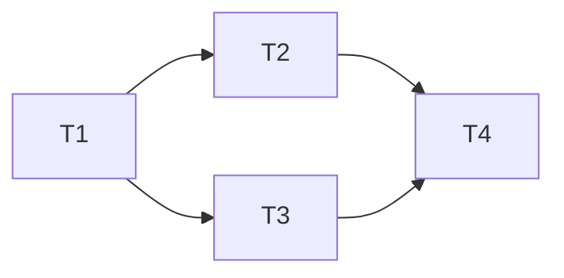

# Harness Orchestrator — 团队编排器

## 核心理念

**人类掌舵，智能体执行。** 工程师的角色从编写代码转向设计环境、明确意图、构建反馈回路。

## Hooks 集成

本编排器在各阶段自动触发 `hooks-framework` 中定义的钩子：

- **Pre-execution**：context-check, env-verify, plan-inject
- **Post-execution**：lint-check, test-run, quality-gate
- **Interception**：continuation (Ralph Loop), compaction, tool-offload
- **Observation**：trace-log, quality-metric, drift-detect

详见 `.claude/skills/hooks-framework/SKILL.md`。

## Phase 0: 上下文检查

在工作流开始前，检查现有输出确定执行模式：

- `.workspace/` 存在 + 用户请求部分修改 → **部分重执行**（仅调用相关 agent）
- `.workspace/` 存在 + 用户提供新输入 → **新执行**（移动 `.workspace/` 到 `.workspace_prev/`）
- `.workspace/` 不存在 → **初始执行**

## Phase 1: 项目探测与需求分析

**执行模式：Sub-agent**

1. 并行调用探测：
   - 技术栈识别（package.json / Cargo.toml / go.mod / pyproject.toml）
   - 目录结构分析
   - 现有文档扫描
   - 目标 AI 工具检测（claude-code / codex / opencode）

2. 输出：`01_project_analysis.json`

```json
{
  "tech_stack": "typescript",
  "framework": "next.js",
  "target_tools": ["claude-code", "codex", "opencode"],
  "existing_docs": [],
  "directory_structure": {}
}
```

## Phase 2: 架构设计

**执行模式：Agent Team**

1. 创建团队：architect + context-engineer
2. architect 设计分层架构规则
3. context-engineer 规划知识库结构
4. 团队成员通过 SendMessage 协调

**输出：**
- `02_architecture.md` — 架构设计
- `02_context_plan.md` — 知识库规划
- `02_plan.md` — 执行计划（任务分解、依赖关系、并行策略）

## Phase 3: 知识库搭建

**执行模式：Agent Team**

1. 创建团队：context-engineer + builder
2. context-engineer 生成 AGENTS.md 和 docs/ 结构
3. builder 生成骨架文档

**输出：**
- `AGENTS.md`
- `docs/` 目录及骨架文档

## 并行执行策略

**原则：** 独立子任务并行执行，依赖任务串行执行。

### 子代理生成机制

1. **任务分解**：从 `02_plan.md` 读取任务列表
2. **依赖分析**：识别任务间的依赖关系
3. **并行分组**：将无依赖的任务分组，每组可并行执行
4. **子代理生成**：为每组任务生成独立子代理

```javascript
// 伪代码示例
const tasks = readPlan('02_plan.md')
const groups = analyzeDependencies(tasks)

for (const group of groups) {
  // 并行启动子代理
  await Promise.all(group.map(task => spawnSubagent(task)))
}
```

### 并行执行规则

| 规则 | 说明 |
|------|------|
| 最大并行数 | 默认 3 个子代理（可配置） |
| 超时控制 | 每个子代理 10 分钟超时 |
| 错误处理 | 单个子代理失败不影响其他 |
| 结果聚合 | 所有子代理完成后统一收集结果 |

### 子代理通信

- **共享文件系统**：通过 `.workspace/` 目录共享数据
- **消息传递**：通过 SendMessage 协调（仅在必要时）
- **状态文件**：每个子代理写入状态文件（`.workspace/subagent_*.json`）

## Phase 4: 技能生成

**执行模式：Sub-agent（并行）**

1. 根据项目需求选择标准技能包
2. 并行调用 builder agent 生成各技能
3. sre agent 配置可观测性和熵管理（如需要）

**输出：**
- `.claude/skills/` 目录下的技能文件

## Phase 5: 质量审查

**执行模式：Agent Team**

1. 创建团队：reviewer + architect
2. reviewer 审查所有产出物
3. architect 验证架构约束一致性

**输出：**
- `05_review_report.md` — 审查报告

## Phase 6: 验证

**执行模式：Sub-agent**

1. qa agent 执行结构验证
2. qa agent 执行触发验证
3. qa agent 执行干跑验证

**输出：**
- `06_verification_report.md` — 验证报告

## Phase 7: 注册与交付

**执行模式：Sub-agent**

1. 生成 CLAUDE.md（含 harness 指针和变更历史）
2. 清理 `.workspace/` 中间产物
3. 生成最终交付清单

**输出：**
- `CLAUDE.md`
- 交付清单

## 数据传输协议

| Phase | 输出位置 | 下一 Phase 读取方式 |
|-------|----------|---------------------|
| 1 | `.workspace/01_*.json` | Phase 2 读取 |
| 2 | `.workspace/02_*.md` | Phase 3 读取 |
| 3 | 项目根目录 | Phase 4+ 直接读取 |
| 4 | `.claude/skills/` | Phase 5 读取 |
| 5 | `.workspace/05_*.md` | Phase 6 读取 |
| 6 | `.workspace/06_*.md` | Phase 7 读取 |
| 7 | 项目根目录 | 最终交付 |

## 计划文件规范

**文件位置：** `.workspace/02_plan.md`

**格式要求：**
```markdown
# 执行计划

## 任务列表

| ID | 任务 | 依赖 | 预估时间 | 状态 |
|----|------|------|----------|------|
| T1 | 生成 AGENTS.md | 无 | 2min | pending |
| T2 | 创建 docs/ 结构 | T1 | 3min | pending |
| T3 | 配置 hooks | T1 | 5min | pending |
| T4 | 生成 skills | T2, T3 | 10min | pending |

## 并行分组

- **组 1**（可并行）：T1
- **组 2**（可并行）：T2, T3
- **组 3**（串行）：T4

## 依赖图



## 里程碑

- M1: 知识库搭建完成（T1, T2）
- M2: 基础设施就绪（T3）
- M3: 技能生成完成（T4）
```

**使用方式：**
- Phase 2 生成计划文件
- Phase 4 读取计划文件，按并行分组执行
- 每个任务完成后更新状态
- 最终清理时归档到 `.workspace/completed/`

## 错误处理

| 错误类型 | 策略 |
|----------|------|
| Agent 超时 | 重试一次，跳过并记录 |
| 输出格式错误 | 要求 agent 修正后重新提交 |
| Agent 间冲突 | 由 reviewer 仲裁 |
| 缺少依赖 | 暂停当前 phase，先解决依赖 |

## 团队规模指南

| 工作规模 | 推荐团队大小 | 每成员任务数 |
|----------|-------------|-------------|
| 小型（5-10 任务） | 2-3 成员 | 3-5 |
| 中型（10-20 任务） | 3-5 成员 | 4-6 |
| 大型（20+ 任务） | 5-7 成员 | 4-5 |

## 测试场景

### 正常流程
用户："为这个 Next.js 项目配置 harness"  
预期：完整执行 Phase 1-7，输出所有配置文件

### 错误流程
用户："更新 harness 的质量审查标准"  
预期：Phase 0 检测到现有配置 → 部分重执行 → 仅更新 quality-gate skill 和相关文档
