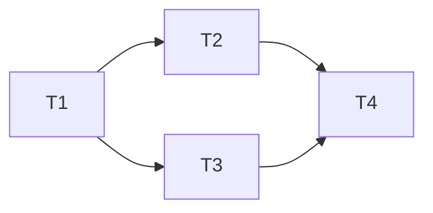

<!-- HARNESS-PILOT:START -->

## Architecture Map
- AGENTS.md — main project doc and harness pointer (CLAUDE.md removed)
- Agent definitions: `.agents/agents/` — 7 specialized agents
- Skill definitions: `.agents/skills/` — 14 standard skills
- Install script: `scripts/install.mjs` — unified installer

## Key Constraints
- **Humans steer, agents execute** — engineer designs environment, AI writes code
- **Repo = system of record** — knowledge outside repo doesn't exist to agents
- **Map, not manual** — AGENTS.md is TOC, not encyclopedia
- **Constraints = multipliers** — rigid architecture boundaries enable speed

## Agent Team

| Agent | Role |
|-------|------|
| orchestrator | Team coordinator, manages task dispatch and phase transitions |
| architect | Architecture designer, defines layer boundaries and taste invariants |
| builder | Code generator, produces implementation within constraints |
| reviewer | Quality reviewer, code review and taste validation |
| qa | Verification engineer, testing and trigger checks |
| sre | Site reliability engineer, observability and entropy management |
| context-engineer | Context engineer, knowledge architecture management |

## Skills

| Skill | Purpose |
|-------|---------|
| harness-orchestrator | Team orchestrator, coordinates all agents |
| harness-init | One-click harness init |
| context-setup | Knowledge base architecture generation |
| architecture-guard | Architecture boundary enforcement |
| entropy-gc | Entropy management & garbage collection |
| observability-setup | Observability stack config |
| sandbox-exec | Secure code execution environment |
| quality-gate | Quality review gate |
| agent-readability | Agent readability optimization |
| harness-evolve | Feedback-driven evolution |
| hooks-framework | Deterministic execution hooks |
| web-search | Web search integration |
| mcp-connector | MCP tool connector |
| api-translation | API format translation (Anthropic↔OpenAI bridge) |
| tool-search | Dynamic tool discovery |

## Navigation
- New project init? Use `harness-init` or `harness-orchestrator` skill
- Architecture design? Read `.agents/agents/architect.md`
- Quality review? Read `.agents/skills/quality-gate/SKILL.md`
- Knowledge management? Read `.agents/skills/context-setup/SKILL.md`
- Evolution feedback? Read `.agents/skills/harness-evolve/SKILL.md`
- Hooks config? Read `.agents/skills/hooks-framework/SKILL.md`
- Web search? Read `.agents/skills/web-search/SKILL.md`
- MCP integration? Read `.agents/skills/mcp-connector/SKILL.md`
- Install? Read `README.md` or run `bun run scripts/install.mjs --help`
- Sandbox config? Read `docs/SANDBOX.md` or run `.agents/skills/sandbox-exec/scripts/sandbox/run-in-sandbox.sh`
- Format translation logic? Read `.agents/skills/api-translation/SKILL.md` — format pairs, stream patterns, vision routing
- API endpoints & features? Read `README.md` for the full endpoint reference
- Plugin architecture? Read `src/translate/plugin.ts` — `TranslatorRegistry`, `FormatPair` interfaces
- Provider routing? Read `src/providers.ts` — `ProviderRegistry`, `resolveByPrefix()`
- Observability metrics? Read `src/handlers/metrics.ts` — Prometheus format, 6 metric types
- Audit events? Read `src/audit.ts` — 6 event types, `/audit/log` endpoint
- Request validation? Read `src/validate.ts` — Zod v4 schemas for 3 API formats
- Rate-limit tracking? Read `src/rate-limit.ts` — upstream RateLimit-* header tracking
- Response caching? Read `src/response-cache.ts` — in-memory LRU cache
- Load testing? Run `bun run scripts/load-test.mjs --help`
- Dependency audit? Run `bun run scripts/audit-deps.mjs --ci`
- OpenAPI spec? Run `bun run scripts/generate-openapi.mjs --save`
- CI/CD? Read `.github/workflows/ci.yml` — test + audit dual jobs

<!-- HARNESS-PILOT:END -->
- Skill: harness-orchestrator
> Harness team orchestrator. Coordinates agent/skill execution, phase transitions, data handoff. Triggers on explicit requests: "运行 harness", "harness run", "执行 harness", "启动 orchestrator", "开始编排". For init use harness-init instead.

# Harness Orchestrator — Team Orchestrator

## Core Philosophy

**Humans steer, agents execute.** The engineer's role shifts from writing code to designing environments, articulating intent, and building feedback loops.

## Hooks Integration

This orchestrator automatically triggers hooks defined in `hooks-framework` at each phase:

- **Pre-execution**: context-check, env-verify, plan-inject
- **Post-execution**: lint-check, test-run, quality-gate
- **Interception**: continuation (Ralph Loop), compaction, tool-offload
- **Observation**: trace-log, quality-metric, drift-detect

See `.agents/skills/hooks-framework/SKILL.md` for details.

## Phase 0: Context Check

Before workflow starts, check existing outputs to determine execution mode:

- `.harness-pliot/` exists + user requests partial modification → **Partial Re-execution** (only invoke relevant agents)
- `.harness-pliot/` exists + user provides new input → **New Execution** (write outputs directly into `.harness-pliot/`, overwriting existing files)
- `.harness-pliot/` does not exist → **Initial Execution**

## Phase 1: Project Discovery & Requirements Analysis

**Execution Mode: Sub-agent**

1. Parallel discovery calls:
   - Tech stack identification (package.json / Cargo.toml / go.mod / pyproject.toml)
   - Directory structure analysis
   - Existing documentation scan
   - Target AI tool detection (claude-code / codex / opencode)

2. Output: `01_project_analysis.json`

```json
{
  "tech_stack": "typescript",
  "framework": "next.js",
  "target_tools": ["claude-code", "codex", "opencode"],
  "existing_docs": [],
  "directory_structure": {}
}
```

## Phase 2: Architecture Design

**Execution Mode: Agent Team**

1. Create team: architect + context-engineer
2. architect designs layered architecture rules
3. context-engineer plans knowledge base structure
4. Team members coordinate via SendMessage

**Output:**
- `02_architecture.md` — Architecture design
- `02_context_plan.md` — Knowledge base plan
- `02_plan.md` — Execution plan (task breakdown, dependencies, parallel strategy)

## Phase 3: Knowledge Base Construction

**Execution Mode: Agent Team**

1. Create team: context-engineer + builder
2. context-engineer generates AGENTS.md and docs/ structure
3. builder generates skeleton documents

**Output:**
- `AGENTS.md`
- `docs/` directory and skeleton documents

## Parallel Execution Strategy

**Principle:** Independent subtasks execute in parallel, dependent tasks execute serially.

### Sub-agent Generation Mechanism

1. **Task Breakdown**: Read task list from `02_plan.md`
2. **Dependency Analysis**: Identify dependencies between tasks
3. **Parallel Grouping**: Group tasks with no dependencies; each group can execute in parallel
4. **Sub-agent Generation**: Generate independent sub-agents for each task group

```javascript
// Pseudocode example
const tasks = readPlan('02_plan.md')
const groups = analyzeDependencies(tasks)

for (const group of groups) {
  // Launch sub-agents in parallel
  await Promise.all(group.map(task => spawnSubagent(task)))
}
```

### Parallel Execution Rules

| Rule | Description |
|------|------|
| Max Parallelism | Default 3 sub-agents (configurable) |
| Timeout Control | Each sub-agent 10-minute timeout |
| Error Handling | Single sub-agent failure does not affect others |
| Result Aggregation | Collect results after all sub-agents complete |

### Sub-agent Communication

- **Shared Filesystem**: Share data via `.harness-pliot/` directory
- **Message Passing**: Coordinate via SendMessage (only when necessary)
- **Status Files**: Each sub-agent writes status files (`.harness-pliot/subagent_*.json`)

## Phase 4: Skill Generation

**Execution Mode: Sub-agent (parallel)**

1. Select standard skill packages based on project needs
2. Invoke builder agents in parallel to generate each skill
3. sre agent configures observability and entropy management (if needed)

**Output:**
- Skill files under `.agents/skills/` directory

## Phase 5: Quality Review

**Execution Mode: Agent Team**

1. Create team: reviewer + architect
2. reviewer reviews all deliverables
3. architect verifies architecture constraint consistency

**Output:**
- `05_review_report.md` — Review report

## Phase 6: Verification

**Execution Mode: Sub-agent**

1. qa agent performs structural verification
2. qa agent performs trigger verification
3. qa agent performs dry-run verification

**Output:**
- `06_verification_report.md` — Verification report

## Phase 7: Registration & Delivery

**Execution Mode: Sub-agent**

1. Generate CLAUDE.md (harness pointer only, change history → docs/CHANGELOG.md)
2. Clean up `.harness-pliot/` intermediate artifacts
3. Generate final delivery checklist

**Output:**
- `CLAUDE.md`
- Delivery checklist

## Input/Output Protocol

| Phase | Output Location | Next Phase Reads |
|-------|----------|---------------------|
| 1 | `.harness-pliot/01_*.json` | Phase 2 reads |
| 2 | `.harness-pliot/02_*.md` | Phase 3 reads |
| 3 | Project root | Phase 4+ reads directly |
| 4 | `.agents/skills/` | Phase 5 reads |
| 5 | `.harness-pliot/05_*.md` | Phase 6 reads |
| 6 | `.harness-pliot/06_*.md` | Phase 7 reads |
| 7 | Project root | Final delivery |

## Plan File Specification

**File Location:** `.harness-pliot/02_plan.md`

**Format Requirements:**
```markdown
# Execution Plan

## Task List

| ID | Task | Dependencies | Estimated Time | Status |
|----|------|------|----------|------|
| T1 | Generate AGENTS.md | None | 2min | pending |
| T2 | Create docs/ structure | T1 | 3min | pending |
| T3 | Configure hooks | T1 | 5min | pending |
| T4 | Generate skills | T2, T3 | 10min | pending |

## Parallel Grouping

- **Group 1** (parallelizable): T1
- **Group 2** (parallelizable): T2, T3
- **Group 3** (serial): T4

## Dependency Graph



## Milestones

- M1: Knowledge base construction complete (T1, T2)
- M2: Infrastructure ready (T3)
- M3: Skill generation complete (T4)
```

**Usage:**
- Phase 2 generates the plan file
- Phase 4 reads the plan file, executes per parallel grouping
- Update status after each task completion
- Archive to `.harness-pliot/completed/` during final cleanup

## Error Handling

| Error Type | Strategy |
|----------|------|
| Agent Timeout | Retry once, skip and log |
| Output Format Error | Require agent to correct and resubmit |
| Inter-agent Conflict | Arbitrated by reviewer |
| Missing Dependency | Pause current phase, resolve dependency first |

## Team Size Guidelines

| Work Scale | Recommended Team Size | Tasks per Member | Max Parallelism |
|----------|-------------|-------------|-----------|
| Small (5-10 tasks) | 2-3 members | 3-5 | 3 |
| Medium (10-20 tasks) | 3-5 members | 4-6 | 5 |
| Large (20-50 tasks) | 5-7 members | 4-5 | 7 |
| Very Large (50-200 tasks) | 7-15 members | 5-10 | 15 |
| Massively Parallel (200+ tasks) | 15-50 members | 5-10 | 50 |

### Massively Parallel Strategy

**Applicable Scenarios:** Batch code migration, repo-wide refactoring, multi-module parallel builds.

**Core Mechanisms:**
- **Sharding**: Shard codebase by directory/module; independent agent per shard
- **Shared State Isolation**: Independent git worktree per agent; merge results via merge
- **Batch Merge**: Unified merge after all agents complete; conflicts arbitrated by orchestrator
- **Progress Aggregation**: All agents write to unified progress file (`.harness-pliot/progress.json`)

**Constraints:**
- Disable intermediate user messaging during massively parallel execution (avoid information flood)
- All agents communicate only via `.harness-pliot/`, do not use `SendMessage` (avoid message storm)
- Single agent timeout does not affect others; check completeness during final aggregation

## Test Scenarios

### Normal Flow
User: "Configure harness for this Next.js project"  
Expected: Execute Phase 1-7 fully, output all configuration files

### Error Flow
User: "Update harness quality review standards"  
Expected: Phase 0 detects existing configuration → Partial re-execution → Only update quality-gate skill and related documents

Arguments: 深入分析当前项目，还存在哪些缺陷或功能完整性缺失
